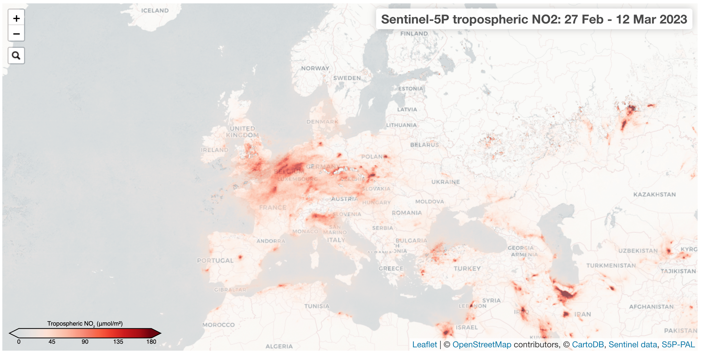
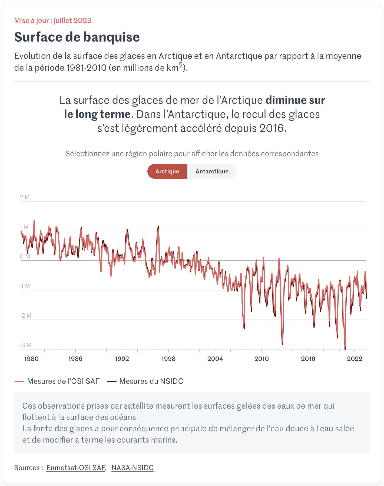

.. _example-stories:

Examples stories and visualisation for different environmental thematics
========================================================================

.. _air-quality-wildfires:

Air quality and wildfires
-------------------------

.. figure:: ../../img/IASI_NH3.png
   :target: https://squares.ulb.be//NH3-IASI.html
   :width: 100%
   :alt: IASI NH3

   Ammonia concentration measured by IASI, overlaid on a map of likely production sites (Credit: Lieven Clarisse and Martin Van Damme)

\\

   Nitrogen dioxide measure by Sentinel-5P (Credit: ESA)

\\

.. figure:: https://pbs.twimg.com/media/EJAg2NbXYAAb-Vc?format=jpg&name=4096x4096
   :target: https://twitter.com/Pierre_Markuse/status/1193490034302889984
   :width: 100%
   :alt: Australia wildfires

   Wildfire extent captured by in the visible and short wave infra-red by Sentinel-2 (Credit: Pierre Markuse)

\\

.. figure:: https://atmosphere.copernicus.eu/sites/default/files/inline-images/MicrosoftTeams-image%20%2814%29_0.png
   :target: https://atmosphere.copernicus.eu/three-peculiar-antarctic-ozone-hole-seasons-row-what-we-know
   :width: 100%
   :alt: CAMS ozone hole

   Evolution of the ozone hole (Credit: Copernicus Atmospheric Monitoring Service)

\\

.. figure:: https://www.esa.int/var/esa/storage/images/esa_multimedia/images/2021/10/la_palma_lava_flows_into_the_sea/23490642-1-eng-GB/La_Palma_lava_flows_into_the_sea_pillars.jpg
   :target: https://www.esa.int/ESA_Multimedia/Images/2021/10/La_Palma_lava_flows_into_the_sea
   :width: 100%
   :alt: ESA La Palma lava flow

   Lava flow and ash plume from the La Palma Volcano, captured by Copernicus Sentinel-2 (Credit: ESA)

.. _oceans-sea-ice:

Oceans and sea ice
------------------

* Fabrice: Sea ocean velocity

* Olivier: Ice visualisations and C3S report

.. raw:: html

    <embed>
      <blockquote class="twitter-tweet">
According to <a href="https://twitter.com/hashtag/Venice?src=hash&amp;ref_src=twsrc%5Etfw">#Venice</a>&#39;s 🇮🇹 citizens, waters have cleared following the <a href="https://twitter.com/hashtag/COVID19?src=hash&amp;ref_src=twsrc%5Etfw">#COVID19</a> lock-down. But what can we see from <a href="https://twitter.com/hashtag/Sentinel2?src=hash&amp;ref_src=twsrc%5Etfw">#Sentinel2</a> 🛰️🇪🇺?  A notable difference in boat traffic between 8 February &amp; 19 March, as well as seemingly less turbid/agitated waters. What do you think?<a href="https://twitter.com/hashtag/EUSpace?src=hash&amp;ref_src=twsrc%5Etfw">#EUSpace</a> <a href="https://t.co/HnqmjOdDCN">pic.twitter.com/HnqmjOdDCN</a>
&mdash; Copernicus EU (@CopernicusEU) <a href="https://twitter.com/CopernicusEU/status/1242393973559304193?ref_src=twsrc%5Etfw">March 24, 2020</a></blockquote> 
    </embed>

.. figure:: https://factcheck.afp.com/sites/default/files/styles/list_xl/public/medias/factchecking/g2/2022-05/eeca136988861b80b92492200de4e567.jpeg
   :target: https://factcheck.afp.com/doc.afp.com.32AB8TN
   :width: 100%
   :alt: OSI SAF Arctic ice coverage time series

   Annual change in Arctic sea ice coverage in May since 1980 (Credit: Associated Free Press and EUMETSAT OSI SAF)

   Change in Arctic and Antarctic sea ice coverage since 1980 (Credit: Le Monde and EUMETSAT OSI SAF)

.. figure:: https://www.orbitaleos.com/wp-content/uploads/2021/05/Screenshot-2021-05-07-172544-1-scaled.jpeg
   :target: https://www.orbitaleos.com
   :width: 100%
   :alt: Satellite-based oil spill tracking

   Satellite use in oil spill tracking (Credit: Orbital EOS and CMCC)

.. _climate-weather:

Climate and weather
-------------------
* ECMWF ice cube example.
* 

.. _climate-extremes:

Climate extremes: heatwaves, changes in ice and drought
-------------------------------------------------------

*
*

