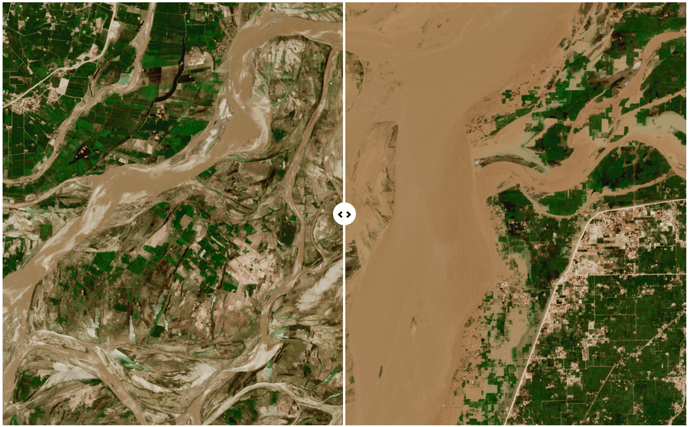

.. _example-stories:

Examples stories and visualisation for different environmental thematics
========================================================================

.. _air-quality-wildfires:

Air quality and wildfires
-------------------------

* Cathy: IASI NH3 (not sure if reproducible as in Nature)
* Mark: Ozone hole & CAMS dust
* Simon: Hunga-Tonga & lava flow

.. _oceans-sea-ice:

Oceans and sea ice
------------------

* Fabrice: Sea ocean velocity
* Olivier: Ice visualisations and C3S report
*

.. _climate-weather:

Climate and weather
-------------------
* ECMWF ice cube example.
* 

.. _climate-extremes:

Climate extremes: heatwaves, changes in ice and drought
-------------------------------------------------------

*
*

Visualisations from journalists to be placed
--------------------------------------------

.. image:: ../../img/Der_Spiegel_air_quality.png
  :target: https://www.spiegel.de/ausland/luftverschmutzung-wo-die-luft-weltweit-am-schlechtesten-ist-und-was-dagegen-getan-werden-kann-a-1e542a7c-a46b-496f-901d-2fd0d85f3939
  :width: 75%
  :alt: Der Spiegel air quality
Caption: credit Der Spiegel

Caption: credit Le Monde, Copernicus

.. image:: https://ichef.bbci.co.uk/news/976/cpsprodpb/177B6/production/_115228169_a68a_iceberg-nc.png
   :target: https://www.bbc.co.uk/news/science-environment-54798031
   :width: 100%
   :alt: BBC A28 Iceberg
Caption: credit BBC

.. image:: https://ichef.bbci.co.uk/news/976/cpsprodpb/5269/production/_125979012_turbines-nc.png
   :target: https://www.bbc.co.uk/news/science-environment-62227866
   :width: 100%
   :alt: BBC infrared turbines
Caption: credit BBC

.. image:: https://ichef.bbci.co.uk/news/976/cpsprodpb/12B3A/production/_130020667_nordstream.jpg
   :target: https://www.bbc.co.uk/news/science-environment-65775901
   :width: 100%
   :alt: BBC Nordtream pipeline
Caption: credit BBC

.. image:: https://www.washingtonpost.com/wp-stat/graphics/ai2html/BAREGLACIER/JVLNOZOJMNHU5LWJURSPSF42XI/eagle_island-xlarge.jpg
   :target: https://www.washingtonpost.com/climate-environment/2023/03/24/antarctica-peninsula-glaciers-snow-melt-warm-temperatures/
   :width: 100%
   :alt: Washington Post Eagle Island glacier
Caption: credit Washington Post

Visualisations from social media to be placed
---------------------------------------------

.. image:: https://twitter.com/i/status/1324996921136705536
   :target: https://twitter.com/i/status/1324996921136705536
   :width: 100%
   :alt: Tweet
Caption: credit ...