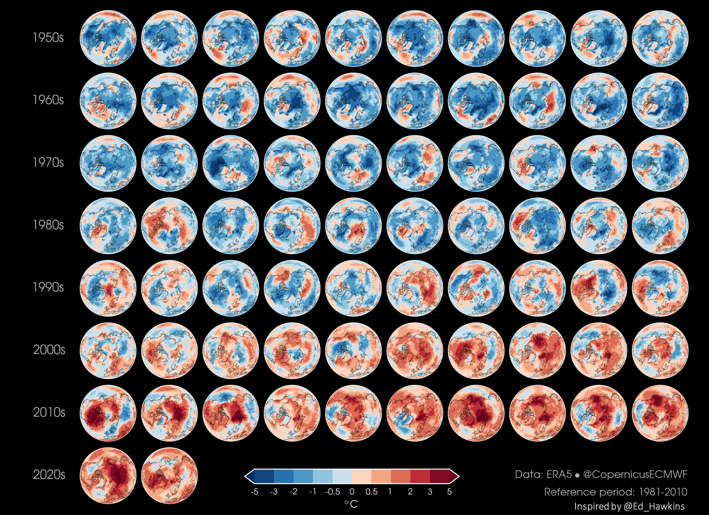
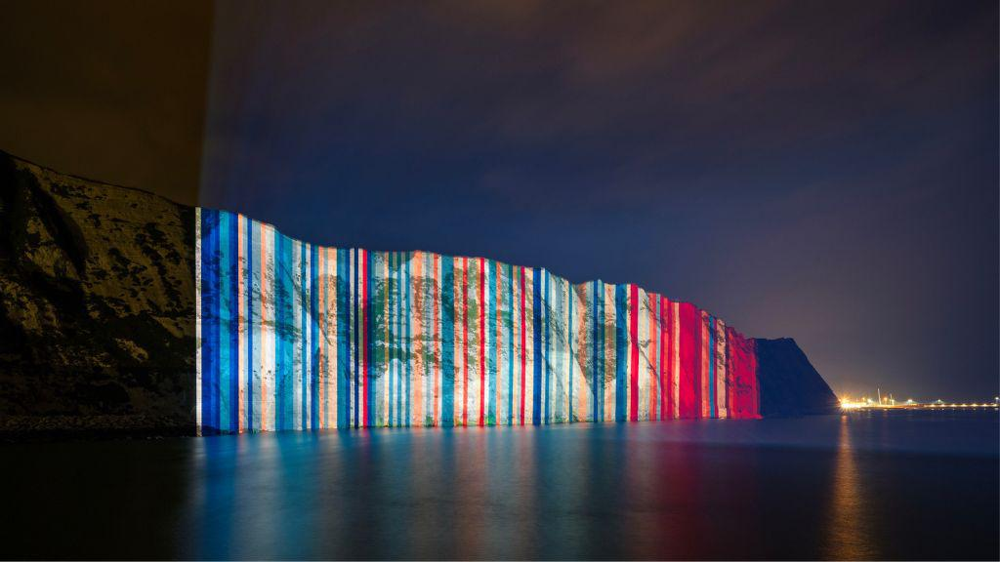

.. _climate-weather:

Climate and weather visualisations
----------------------------------

Even when not visualised itself, data can still inform story telling. Clear and concise statements can distill vast of amounts of data in to stories that anyone can understand. 

.. raw:: html

    <embed>
      <blockquote class="twitter-tweet">
There is a 98% chance of at least one in the next five years beating the temperature record set in 2016.  It is a moral, economic &amp; social imperative to help countries prepare for &amp; adapt to the increasingly harmful impacts of the climate crisis.
&mdash; António Guterres (@antonioguterres) <a href="https://twitter.com/antonioguterres/status/1658842308144504836?ref_src=twsrc%5Etfw">May 17, 2023</a></blockquote> 
    </embed>

Repeating visualisation can readily show signficant changes across a data set.

   *ERA5 annual mean temperature anomaly (Credit: Copernicus Climate Change Service).*

Visualisations have the potential to become memes, and can be repeated in many contexts.

   *Visualising climate stripes (Credit: University of Reading).*

.. figure:: https://pbs.twimg.com/media/Fx2tKJYWwAAaXHG?format=jpg&name=900x900
   :target: https://pbs.twimg.com/media/Fx2tKJYWwAAaXHG?format=jpg&name=900x900
   :width: 100%
   :alt: The Pope discussing climate stripes

   *The Pope discussing climate stripes (Credit: Cristina Nadotti @CriNadot)*

.. figure:: https://www.imperial.ac.uk/ImageCropToolT4/imageTool/uploaded-images/newseventsimage_1667227840660_mainnews2012_x1.jpg
   :target: https://www.imperial.ac.uk/news/241093/imperial-scientists-appear-first-book-teen/
   :width: 100%
   :alt: Greta Thunberg holding "The Climate Book"

   *Greta Thunberg holding "The Climate Book" (Credit: Imperial College London)*

Providing comparisons that people can readily understand, can greatly aid visualisation.

.. figure:: https://climate.copernicus.eu/sites/default/files/inline-images/ESOTC_Glaciericeloss_small_0.png
   :target: https://climate.copernicus.eu/esotc/2022/ocean
   :width: 100%
   :alt: Glacial ice loss

   Glacial ice loss in the alps in 2022 (Credit: Copernicus Climate Change Service).

.. raw:: html

    <embed>
      <blockquote class="twitter-tweet">
Extreme heat in 2021 breaks the famous Dust Bowl record from 1936 for hottest summer on record in the USA.  In 1936, we observed a hot blob on a relatively cool planet. Today, we have a hot blob on a warm planet. <a href="https://t.co/H6OgQb6scK">pic.twitter.com/H6OgQb6scK</a>
&mdash; Scott Duncan (@ScottDuncanWX) <a href="https://twitter.com/ScottDuncanWX/status/1437816983186182148?ref_src=twsrc%5Etfw">September 14, 2021</a></blockquote> 
    </embed>

.. raw:: html

    <embed>
      <blockquote class="twitter-tweet">
We have not seen anything like it. We can&#39;t compare this looming heat emergency to summer 1976.  A warmer world, thanks to human induced climate change, makes it almost effortless to break extreme heat thresholds. We continue to see this across the planet - not just in Europe. <a href="https://t.co/z0FpZ3Mcbb">pic.twitter.com/z0FpZ3Mcbb</a>
&mdash; Scott Duncan (@ScottDuncanWX) <a href="https://twitter.com/ScottDuncanWX/status/1548728369738661891?ref_src=twsrc%5Etfw">July 17, 2022</a></blockquote> 
    </embed>

Clear comparisons, with use of consisistent style, labelling, and data baselines, can tell stories of change, and refute inaccurate claims.

------------

.. image:: ../../../img/footer.png
   :width: 60%
   :alt: Copernicus implementation logo
   :align: right

