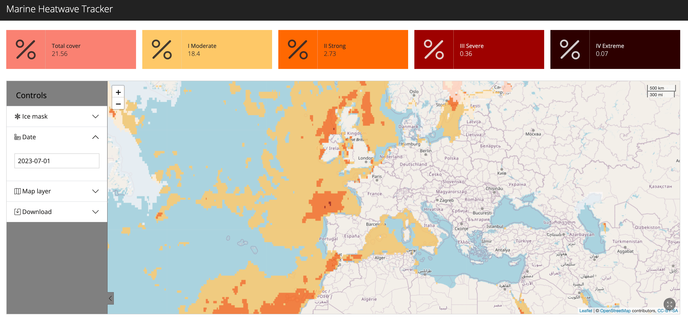
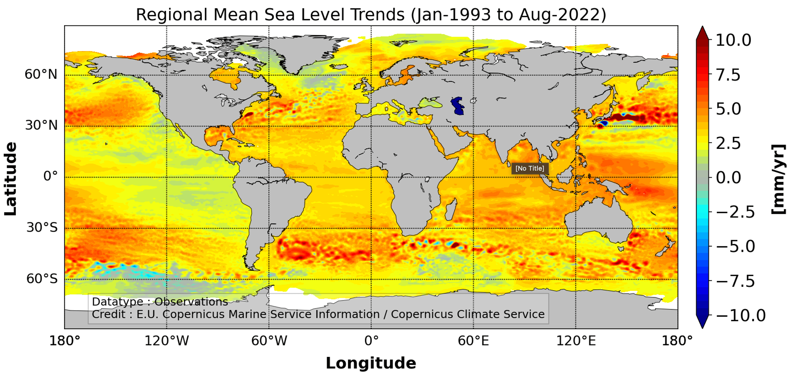
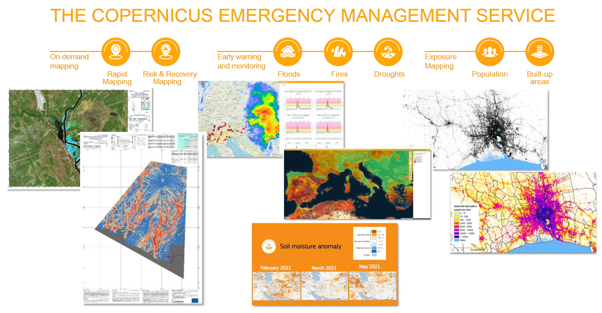

.. _climate-extremes:

Climate extremes: heatwaves, changes in ice and drought visualisations
----------------------------------------------------------------------

.. raw:: html

    <embed>
      <blockquote class="twitter-tweet">
<a href="https://twitter.com/hashtag/Temperature?src=hash&amp;ref_src=twsrc%5Etfw">#Temperature</a> anomalies 1880-2017 by country 🌡. No matter how you visualize it, it looks scary! <a href="https://twitter.com/hashtag/GISTEMP?src=hash&amp;ref_src=twsrc%5Etfw">#GISTEMP</a> <a href="https://twitter.com/hashtag/dataviz?src=hash&amp;ref_src=twsrc%5Etfw">#dataviz</a> <a href="https://twitter.com/hashtag/climatechange?src=hash&amp;ref_src=twsrc%5Etfw">#climatechange</a> <a href="https://twitter.com/hashtag/globalwarming?src=hash&amp;ref_src=twsrc%5Etfw">#globalwarming</a> Download / watch hi-res 🎞: <a href="https://t.co/ZdGPVTM5yO">https://t.co/ZdGPVTM5yO</a> <a href="https://t.co/cAn9wG8FPU">pic.twitter.com/cAn9wG8FPU</a>
&mdash; Antti Lipponen (@anttilip) <a href="https://twitter.com/anttilip/status/1033342041474969601?ref_src=twsrc%5Etfw">August 25, 2018</a></blockquote> 
    </embed>

   Visualising marine heat waves (Credit: marineheatwaves.org).

   Visualising marine heat waves (Credit: Copernicus Marine and Climate Change Services).

..  youtube:: br9N_Cqmfz0

.. raw:: html

    <embed>
      <blockquote class="twitter-tweet">
<a href="https://twitter.com/hashtag/Floods?src=hash&amp;ref_src=twsrc%5Etfw">#Floods</a> in <a href="https://twitter.com/hashtag/EmiliaRomagna?src=hash&amp;ref_src=twsrc%5Etfw">#EmiliaRomagna</a>! <a href="https://twitter.com/hashtag/Copernicus?src=hash&amp;ref_src=twsrc%5Etfw">#Copernicus</a> <a href="https://twitter.com/hashtag/Sentinel3?src=hash&amp;ref_src=twsrc%5Etfw">#Sentinel3</a> captured on May 4 multiple sediments plumes into the Adriatic. <a href="https://twitter.com/hashtag/Italy?src=hash&amp;ref_src=twsrc%5Etfw">#Italy</a>  La violenta <a href="https://twitter.com/hashtag/alluvione?src=hash&amp;ref_src=twsrc%5Etfw">#alluvione</a> che ha colpito l&#39;EmiliaRomagna vista da satellite con lo sversamento dei sedimenti lungo oltre 33 km di costa. <a href="https://twitter.com/hashtag/Ravenna?src=hash&amp;ref_src=twsrc%5Etfw">#Ravenna</a><a href="https://twitter.com/Giulio_Firenze?ref_src=twsrc%5Etfw">@Giulio_Firenze</a> <a href="https://t.co/mbTC9N88EU">pic.twitter.com/mbTC9N88EU</a>
&mdash; ADAM Platform (@PlatformAdam) <a href="https://twitter.com/PlatformAdam/status/1654135153554325508?ref_src=twsrc%5Etfw">May 4, 2023</a></blockquote> 
    </embed>

..  youtube:: CyctkySOLx0

   View options for the Copernicus Emergency Management Service (CEMS) (Credit: Copernicus Emergency Management Service).

We should mention Valentin's presentation from AFP here, but I cannot include any of the images as they are all commercially embargoed unless a license if purchased.

.. raw:: html

    <embed>
      <blockquote class="twitter-tweet">
The recent slow down in sea ice growth in the <a href="https://twitter.com/hashtag/Antarctic?src=hash&amp;ref_src=twsrc%5Etfw">#Antarctic</a> is largely coming from declines (probably wind-driven) in the Ross Sea...  Find a map of the Antarctic regions at <a href="https://t.co/IIUpoChrhG">https://t.co/IIUpoChrhG</a> <a href="https://t.co/x1yoOKmuVr">pic.twitter.com/x1yoOKmuVr</a>
&mdash; Zack Labe (@ZLabe) <a href="https://twitter.com/ZLabe/status/1691224973879504896?ref_src=twsrc%5Etfw">August 14, 2023</a></blockquote> 
    </embed>

.. raw:: html

    <embed>
      <blockquote class="twitter-tweet">
Mosaic of daily average <a href="https://twitter.com/hashtag/Arctic?src=hash&amp;ref_src=twsrc%5Etfw">#Arctic</a> sea ice thickness anomalies over about the last four decades - note the trend...  + Visualization now available through 2022 at: <a href="https://t.co/ysoGwwYtqb">https://t.co/ysoGwwYtqb</a>. Red shading indicates thinner ice. <a href="https://t.co/KxBFCXOrfp">pic.twitter.com/KxBFCXOrfp</a>
&mdash; Zack Labe (@ZLabe) <a href="https://twitter.com/ZLabe/status/1641048446256963584?ref_src=twsrc%5Etfw">March 29, 2023</a></blockquote> 
    </embed>

