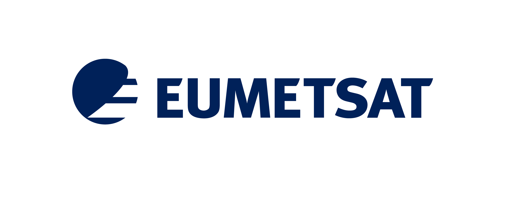
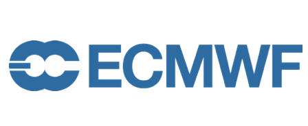
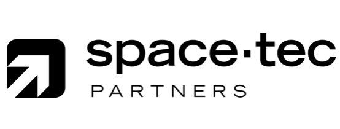

.. _front_page:

Welcome to the Earth observation data visualisation good practice guide
=======================================================================

.. image:: ../../img/EODataViz_Banner.png
  :width: 100%
  :alt: Earth Observation Data Visualisation workshop banner image

Executive summary
----------------

The following points summarise the main messages of the guide.

* **Crafting Impactful Stories:** Earth observation data can be a powerful tool for telling compelling stories, especially when it comes to environmental issues. It's not just about presenting data; it's about weaving it into a narrative that resonates with people.
* **Versatility of Data:** Earth observation data is incredibly versatile. It can be used to monitor everything from climate change to natural disasters. The guide discusses how this data can be tailored to fit various storytelling needs.
* **Effective Data Visualization:** Successfuly visualisations move beyond data presentation, and focus on how to make that data understandable and engaging. This includes choosing the right kind of visualization for your audience, whether it's a simple chart for a general audience or a more complex model for experts.
* **Accessing Data:** Practical advice is given on where to find Earth observation data and how to use it. Quick, "off-the-shelf" solutions for those who need information fast, as well as more customizable options for those who need specific types of data are discussed.
* **Audience:** The guide is open-source and invites ongoing contributions from experts in the field. It serves as a one-stop-shop for journalists, scientists, and data analysts who want to make complex environmental data accessible and impactful.

Background
----------

Throughout the spring of 2023, and under the umbrella of the EU's Copernicus Programme, EUMETSAT coordinated the production of a series of workshops focussed on effective ways to visualise Earth observation data. This series brought together ideas and opinions from journalists, scientists and remote sensing practitioners from operational agencies and industry. 

The workshops offered advice on how to craft impactful stories using products and imagery derived from satellites, as well as giving practical examples and demonstrations of data use and access. 

This document, the Earth observation data visualisation good practice guide, synthesises and summarises the main points of this webinar series, giving examples of effective use of story-telling using satellite data in a variety of contexts.

The guide is by no means a comprehensive overview of all satellite applications, and, given the pace of development in the space sector is unlikely to ever be. It is also not a compendium of all good examples of data visualisation using satellite data, but rather offers representative examples. 

However, the project is ongoing, and open, and you should feel free to contribute to it should you have opinions to share, examples to add, or constructive criticism to offer. If you wish to access the primary material used to create this guide, you can find links to the presentations on the :ref:`workshop presentation <workshop_presentations>` page, or links to the YouTube videos of the presentations on the :ref:`introduction <introduction>` page.

.. note::

   This project is open to community development. If you wish to contribute to the document or share an opinion on it, we'd love to hear from you. Please consult the :ref:`Contribution guidelines <contribution_guidelines>` section for information on how you can get involved.

This guide is written using `Read the docs <https://about.readthedocs.com/>`_. It's source documentation can be found in the following `git repository <https://github.com/wekeo/eo-data-vis-good-practice-guide>`_. 

For any questions about the guide, please contact `ops@eumetsat.int <mailto:ops@eumetsat.int>`_. 

Funding
-------

This project was funded by the EU `Copernicus Programme <https://www.copernicus.eu/en>`_ and coordinated by `EUMETSAT <http://www.eumetsat.int>`_ in partnership with `ECMWF <https://www.ecmwf.int/>`_, `Mercator Ocean International <https://www.mercator-ocean.eu/en/>`_ and the `European Environment Agency <https://www.eea.europa.eu/en>`_. 

The webinar series and resulting guide was delivered, under contract to EUMETSAT, by `SpaceTec Partners <https://www.spacetec.partners/>`_ and `Innoflair UG <https://www.innoflair.com/>`_.

Contents
--------

.. toctree::
   :maxdepth: 2

   01_introduction
   02_acknowledgements_and_authors
   03_contribution_guidelines
   04_what_makes_a_good_story/04_0_index
   05_what_can_eo_observe/05_0_index
   06_what_makes_a_visualisation/06_0_index
   07_access_and_tools/07_0_index
   08_examples/08_0_index
   09_data_providers
   10_workshop_presentations

------------

------------

